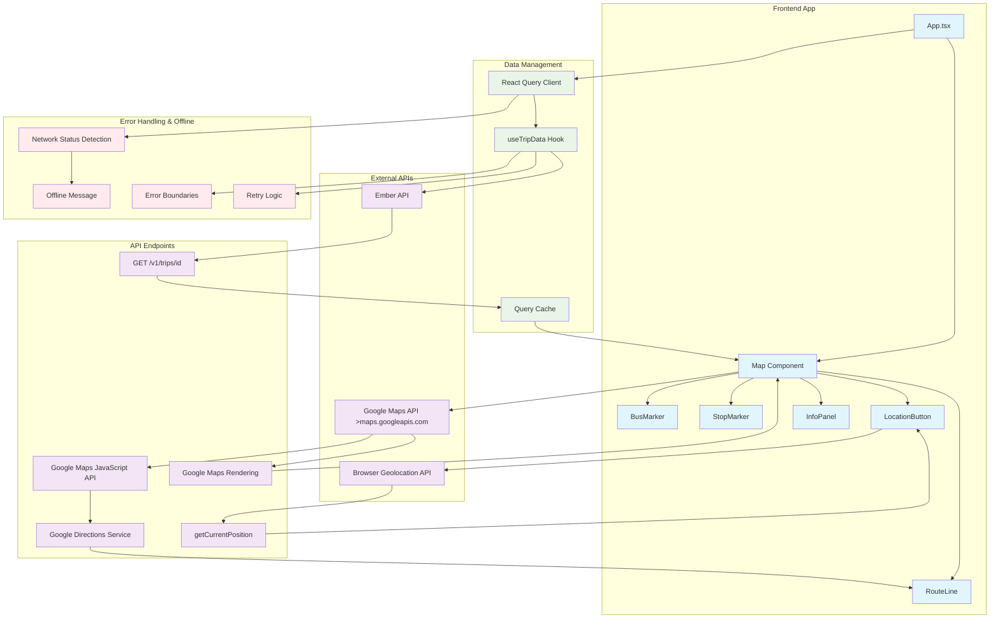

# Trip Bus Info App - API Interaction Diagram

## Overview

This diagram illustrates how the Trip Bus Info application interacts with external APIs to provide real-time bus tracking and mapping functionality.

## API Interactions

## Detailed API Interactions

### 1. Ember API (Trip Data)

- **Endpoint**: `https://api.ember.to/v1/trips/**`
- **Method**: GET
- **Purpose**: Fetch real-time trip information including:
  - Bus location (GPS coordinates)
  - Route stops and schedules
  - Vehicle information
  - Departure/arrival times
- **Error Handling**:
  - 403: Access denied
  - 404: Trip not found
  - 500: Server error
  - Retry logic (up to 2 attempts when online)

### 2. Google Maps API

- **Service**: Google Maps JavaScript API
- **Key Features**:
  - Map rendering and display
  - Directions Service for route visualization
  - Geocoding and reverse geocoding
  - Custom markers and overlays
- **Components Used**:
  - `@react-google-maps/api` library
  - Directions Service for route lines
  - Custom markers for bus and stops
  - Map controls and interactions

### 3. Browser Geolocation API

- **Method**: `navigator.geolocation.getCurrentPosition()`
- **Purpose**: Get user's current location
- **Features**:
  - High accuracy positioning
  - 10-second timeout
  - Error handling for permission denied, unavailable, timeout
  - Automatic map centering on user location

## Data Flow

1. **App Initialization**:

   - React Query client configured with offline-first strategy
   - Trip ID extracted from URL parameters
   - Default fallback trip ID used if none provided

2. **Trip Data Fetching**:

   - `useTripData` hook manages API calls
   - Data cached by React Query
   - Automatic retries on network failures
   - Offline support with cached data

3. **Map Rendering**:

   - Google Maps API loads asynchronously
   - Trip data used to render:
     - Bus marker at current GPS position
     - Stop markers along the route
     - Route line connecting stops
     - Info panels for detailed information

4. **Real-time Updates**:
   - Bus location freshness checked (5-minute threshold)
   - Outdated location warnings displayed
   - Route visualization updates with new data

## Offline Capabilities

- **Caching**: React Query caches trip data for offline access
- **Network Detection**: Browser's `navigator.onLine` API
- **Graceful Degradation**: App shows offline message when no cached data available
- **Retry Logic**: Automatic retries when connection restored

## Security & Performance

- **API Keys**: Google Maps API key stored in environment variables
- **Error Boundaries**: React error boundaries for graceful error handling
- **Loading States**: Proper loading indicators during API calls
- **Timeout Handling**: 10-second timeout for geolocation requests
